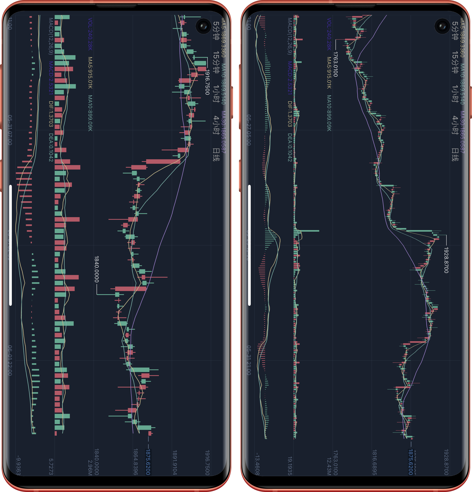

# CandlestickChart-Flutter 

 

## 介绍
一个日本蜡烛图的flutter图表库包含深度图，支持各种指标及放大缩小、平移等操作
 
## 演示


## 简单用例
#### 1.在 pubspec.yaml 中添加依赖
本项目数据来自火币openApi，火币的接口可能需要翻墙，接口失败后会加载本地json。由于项目没有很好的封装，建议使用本地方式使用
```yaml
//本地导入方式
dependencies:
  flutter_k_chart:
    path: 项目路径
```

#### 2.在布局文件中添加
```dart
import 'package:flutter_k_chart/flutter_k_chart.dart';
....
Container(
  height: 450,
  width: double.infinity,
  child: KChartWidget(
    datas,//数据
    isLine: isLine,//是否显示折线图
    mainState: _mainState,//控制主视图指标线
    secondaryState: _secondaryState,//控制副视图指标线
    volState: VolState.VOL,//控制成交量指标线
    fractionDigits: 4,//保留小数位数
  ),
 )
 
 //深度图使用
 Container(
   height: 230,
   width: double.infinity,
   child: DepthChart(_bids, _asks),
 )         
```
#### 3.修改样式
可在chart_style.dart里面修改图表样式

#### 4.数据处理
```dart
//接口获取数据后，计算数据
DataUtil.calculate(datas);
//更新最后一条数据
DataUtil.updateLastData(datas);
//添加数据
DataUtil.addLastData(datas,kLineEntity);
```

#### 国际化 l10n
```dart
import 'package:flutter_k_chart/generated/l10n.dart' as k_chart;
MaterialApp(
      localizationsDelegates: [
        k_chart.S.delegate//国际化
      ],
);
``` 
